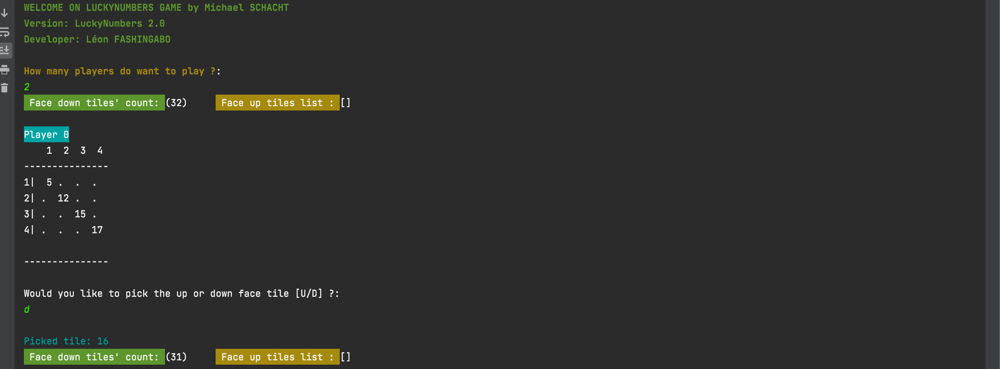
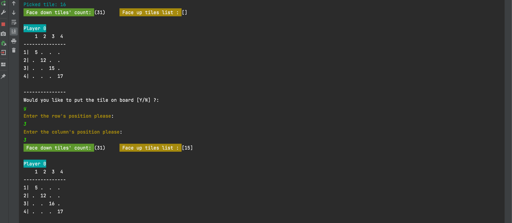

# Lucky Numbers Game

My first development project in java language. It's obviously a project that requires some improvement especially on the tests section that I wrote.

This is to reproduce the famous game __*Lucky Numbers*__ which consists of 2 to 4 players, each with his own game board.

the rules of the game can be viewed at the link below
[Règles de jeu](https://cdn.1j1ju.com/medias/97/b9/d7-lucky-numbers-regle.pdf).

The project is carried out in the MVC format. So there are Model, View and Controller packages each having different classes and a separate class containing the main () method of the whole project.

Regarding the View, the user is initially asked the number of players wishing to take part in the game. The program then displays the two players, the game boards for each player already containing 4 tiles placed diagonally in in croissant order.

It also displays the deck containing the list of face down tiles from which players can draw to play and a table containing a list (which will of course be empty at the start) of face up tiles that players will put back when not served.

The program then asks the first player if he wants to draw a face down or face up tile. And ask him afterwards if he wants to put the tile on the board or to put it back.
If he chooses to place it on the game board, he is asked in which position he wants to place it.

The winner is determined according to the game rules mentioned above.

